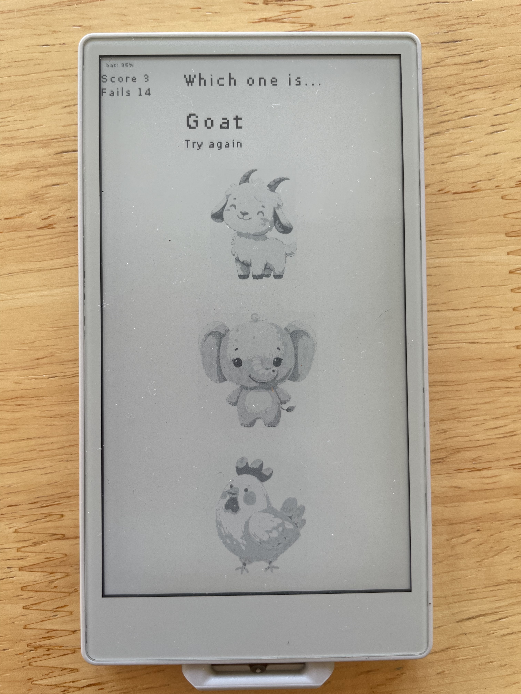

# 🐾 M5PaperS3 Animal Quiz Game  – M5Paper S3 (v0.1)

An educational image-based quiz game designed for children, built for the **M5Paper S3** using **MicroPython (UIFlow 2.0)**.

Touch the correct animal that matches the given name. Tracks correct and incorrect answers, and shows battery status too!
---
## 📸 Screenshot

---

## 🚧 Version

**Current Version: 0.1**

> ⚠️ This is an early prototype. Features and structure may change in future versions.  
> Feedback, suggestions, and contributions are very welcome!

---

## 🖼️ Features

- Touchscreen-based animal guessing game
- Clean layout with three large animal images
- Score tracking (✅ correct / ❌ wrong)
- Battery level indicator
- Designed for vertical layout on M5Paper S3
- Fully offline — loads images from `/flash`

---

## 🧠 How it works

1. The device displays a random animal name.
2. The child touches one of the three animal images shown.
3. If correct, score increases and the game reloads.
4. If wrong, it encourages to "Try again".
5. Battery and score are always visible.

---

## 📂 File Structure

/flash/
├── Bear.png
├── Dog.png
├── Elephant.png
└── … (all your animal images)
m5paperS3-animal-quiz.py

---

## 🔧 Requirements

- M5Paper S3 with **UIFlow 2.2.4-hotfix firmware**
- MicroPython (v1.24+)
- Images preloaded in `/flash` (upload via UIFlow or Thonny)

---

## 📥 Upload Instructions

- Use **Thonny IDE** or **UIFlow 2.0 Web IDE**
- Upload your `m5paperS3-animal-quiz.py` to `/flash/`
- Upload your animal images (`*.png`) to `/flash/`
- Reboot the device and play!

---

## 👶 Perfect For

- Montessori-style animal recognition
- Toddlers learning English vocabulary
- Interactive, offline learning activities

---

## 📸 Screenshot

---

## 💡 Inspiration

Built for my 3-year-old son who loves animals and touching screens 😄

---

## 📄 License

MIT License — free to use, learn, and adapt.
